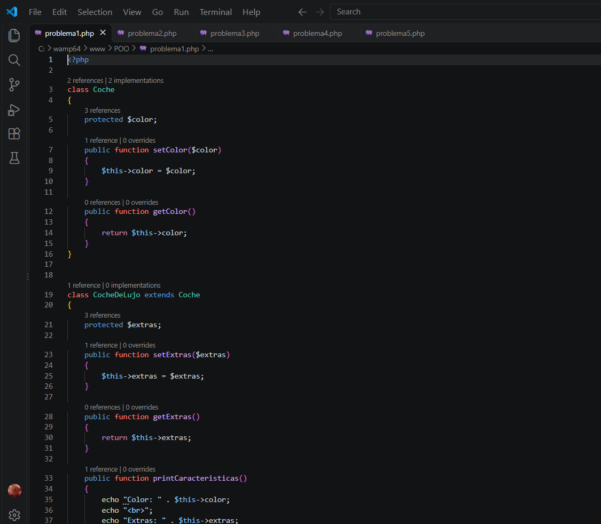
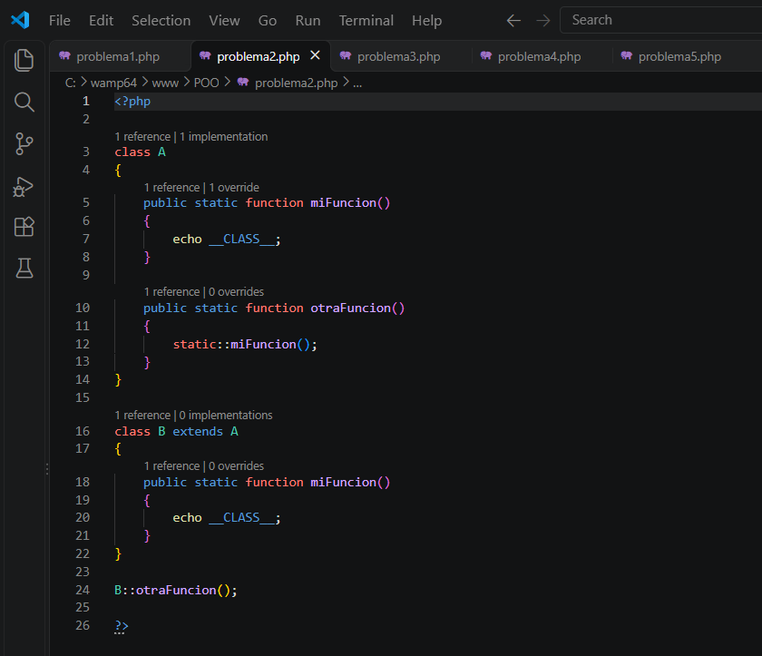
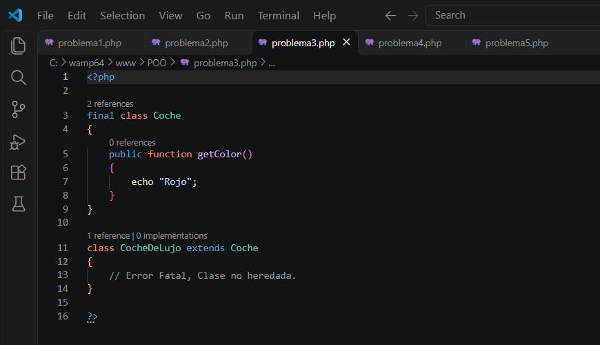
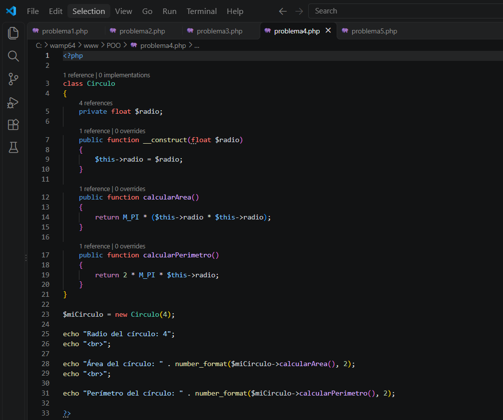
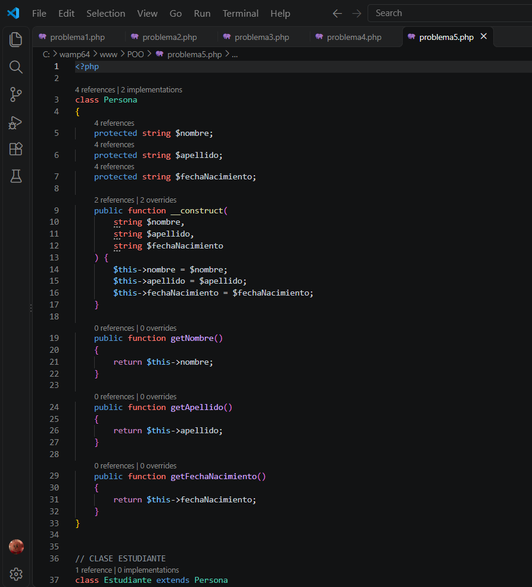
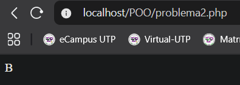
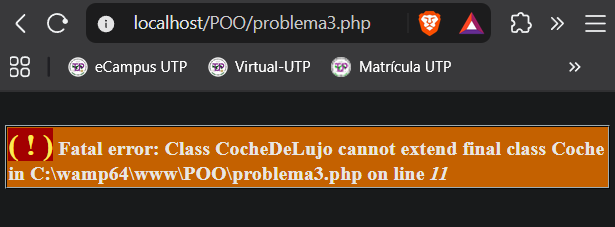
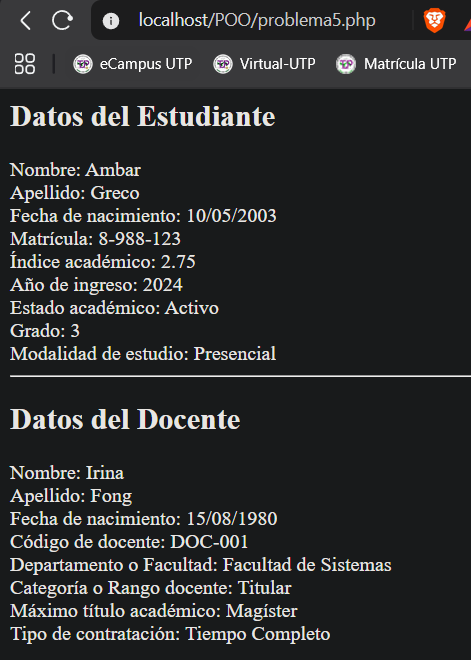

# Laboratorio de Programación Orientada a Objetos (POO)

## Descripción del laboratorio

En este laboratorio se desarrollaron cinco ejercicios prácticos utilizando el lenguaje de programación PHP, aplicando conceptos fundamentales de la programación orientada a objetos.

El objetivo principal fue comprender el funcionamiento de las clases, objetos, atributos, métodos y herencia, mediante la creación y ejecución de diferentes programas.

## Objetivos

- Aplicar los conceptos fundamentales de la programación orientada a objetos.
- Desarrollar programas utilizando PHP.
- Comprender el funcionamiento de clases, atributos y métodos.
- Ejecutar y comprobar los resultados de los ejercicios.
- Documentar el proceso de desarrollo mediante capturas de pantalla.

## Tecnologías utilizadas

- Visual Studio Code
- PHP
- WampServer
- GitHub
- Navegador web

## Desarrollo del laboratorio

En este laboratorio se realizaron cinco ejercicios prácticos, cada uno desarrollado en un archivo PHP independiente.

### Problema 1: Herencia en PHP

Se implementaron clases y métodos utilizando herencia para mostrar las características de un coche.

Resultado obtenido:
- Color: negro
- Extras: TV

### Problema 2: Ejecución en PHP

Se ejecutó el segundo ejercicio en PHP, obteniendo como resultado la letra B.

**Resultado obtenido:** B

### Problema 3: Ejecución en PHP

Se desarrolló el tercer ejercicio utilizando PHP, aplicando los conceptos de programación estudiados en clase.

### Problema 4: Ejecución en PHP

Se desarrolló el cuarto ejercicio utilizando PHP para comprobar el funcionamiento del código y visualizar los resultados en el navegador.

### Problema 5: Ejecución en PHP

Se desarrolló el quinto ejercicio utilizando PHP, reforzando los conocimientos adquiridos durante el laboratorio.

## Proceso de instalación y ejecución

Los ejercicios fueron desarrollados utilizando Visual Studio Code y ejecutados mediante un servidor local configurado con WampServer.

Los archivos se encuentran en la carpeta `C:\wamp64\www\POO\`.

Para visualizar los resultados, se debe iniciar WampServer y acceder desde el navegador a la dirección correspondiente a cada archivo PHP.

## Evidencias del laboratorio

A continuación, se presentan las capturas de pantalla que demuestran el funcionamiento de los cinco ejercicios desarrollados en PHP.

### Evidencia 1: Problema 1

### Evidencia 2: Problema 2

### Evidencia 3: Problema 3

### Evidencia 4: Problema 4

### Evidencia 5: Problema 5

## Autor y referencias

**Estudiante:** Ambar Greco

**Profesora:** Ing. Irina Fong

**Fecha:** Octubre de 2026

**Referencias:**
- https://www.php.net/manual/es/
- Material proporcionado por la profesora.

## Conclusión

Este laboratorio permitió reforzar los conocimientos adquiridos sobre programación orientada a objetos mediante el desarrollo de ejercicios prácticos en PHP. Además, se utilizaron herramientas de desarrollo y ejecución local que facilitaron la comprensión de los conceptos estudiados.
